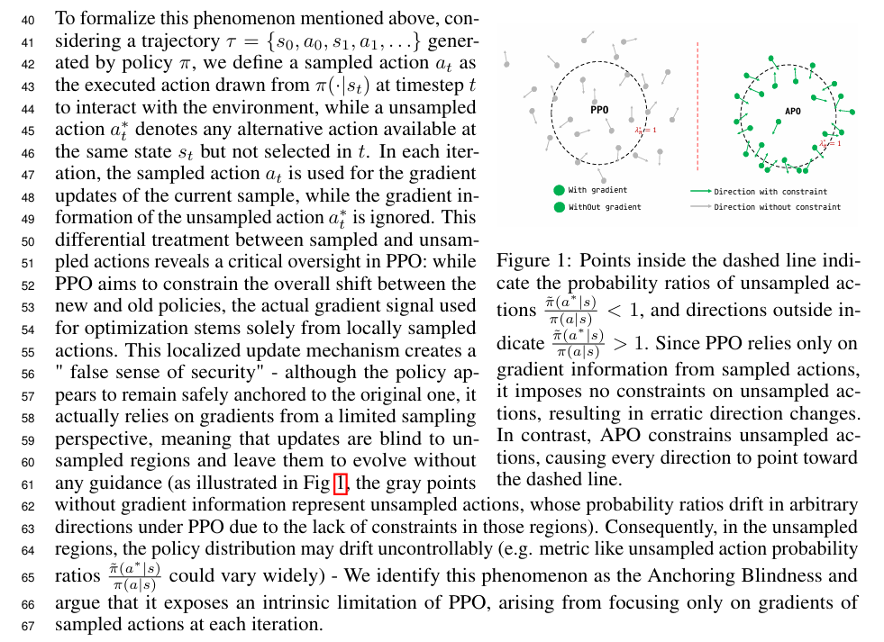
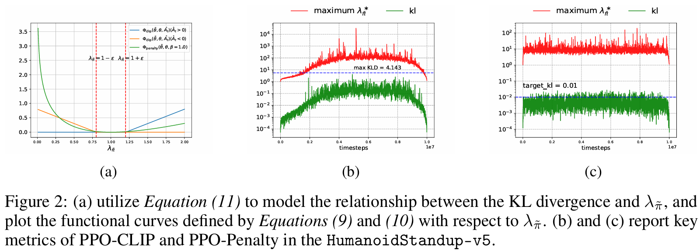
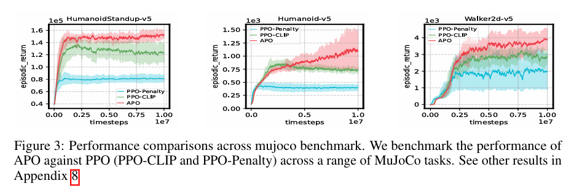
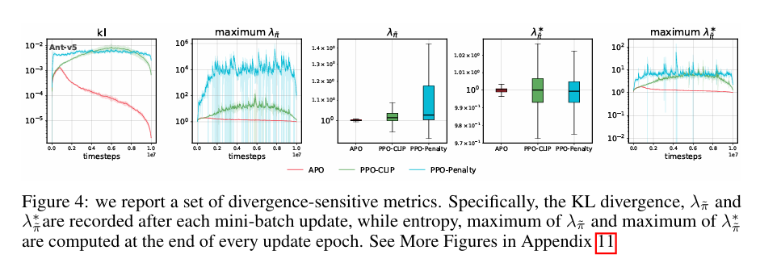

# APO: Anchored Policy Optimization by Leveraging Unsampled Actions in Continuous Spaces

## **Abstract**
Policy gradient methods such as Proximal Policy Optimiztaions (PPO) only constrain policy updates on sampled actions, leaving the unsampled action space entirely unconstrained—a critical oversight we term the Anchoring Blindness. This leads to an uncontrollable drift in the distribution of the policy over the unsampled region, which in turn affects the stability of the policy and falls into suboptimal performance, especially in continuous space. A common approach is to use Kullback-Leibler Divergence to limit the distributional differences, but it is still locally limited by the sampled action perspective. To address this, we propose Anchored Policy Optimization (APO), a variant of PPO that constructs a ratio-based regularization using unsampled actions. Experimental results on the continuous environment MuJoCo show that APO is able to anchor a wider range of action distributions, which improves stability during policy optimization and effectively avoids falling into suboptimality.






## Getting started
We provied a [requirements.txt](./requirements.txt) to build a conda virtual Python environment. Starting with
```cmd
conda create -n env_name python=3.11 --yes
conda activate env_name
```
and install libraries
```cmd
cd APO
pip install -r requirement.txt
```

## Repository structure

Below, we give a description of the main files and directories in this repository.
```bash
src/
├── algos
│   └── ppo_family # algorithms
│       ├── appo 
│       │   ├── con_appo_trainer.py # appo for continous space
│       │   └── dis_appo_trainer.py # appo for discrete space
│       ├── base
│       │   ├── base_trainer.py
│       │   ├── con_policy_value.py # policy-value network for continous
│       │   └── dis_policy_value.py # policy-value network for discrete
│       ├── ppo_clip
│       │   ├── con_ppo2_trainer.py # ppo-clip for continous space
│       │   └── dis_ppo2_trainer.py # ppo-clip for discrete space
│       ├── ppo_penalty
│       │   ├── con_ppo1_trainer.py # ppo-penalty for continous space
│       │   └── dis_ppo1_trainer.py # ppo-penalty for discrete space
│       └── spo
│           └── con_spo_trainer.py
├── buffer
│   ├── base_buffer.py # replay buffer base class
│   ├── con_buffer.py  # replacy buffer for continous space
│   ├── dis_buffer.py
│   └── __init__.py
├── conf
│   ├── con_appo_run.yaml
│   ├── con_ppo1_run.yaml
│   ├── con_ppo2_ent_run.yaml
│   ├── con_ppo2_kl_run.yaml
│   ├── con_ppo2_run.yaml
│   ├── con_spo_run.yaml
│   ├── dis_appo_2_run.yaml
│   ├── dis_exp_run.yaml
│   └── dis_ppo1_run.yaml
├── main.py
├── runner
│   ├── atari_runner.py
│   ├── base_runner.py
│   ├── __init__.py
│   └── mujoco_runner.py
├── scripts
│   ├── appo_atari.sh
│   ├── appo_mujoco.sh
│   ├── mujoco_run.sh
│   ├── ppo1_atari.sh
│   ├── ppo1_mujoco.sh
│   ├── ppo2_atari.sh
│   ├── ppo2_kl_mujoco.sh
│   ├── ppo2_mujoco.sh
│   └── spo_mujoco.sh
└── utils
    ├── config.py
    ├── __init__.py
    ├── mylogging.py
    └── utils.py
```

